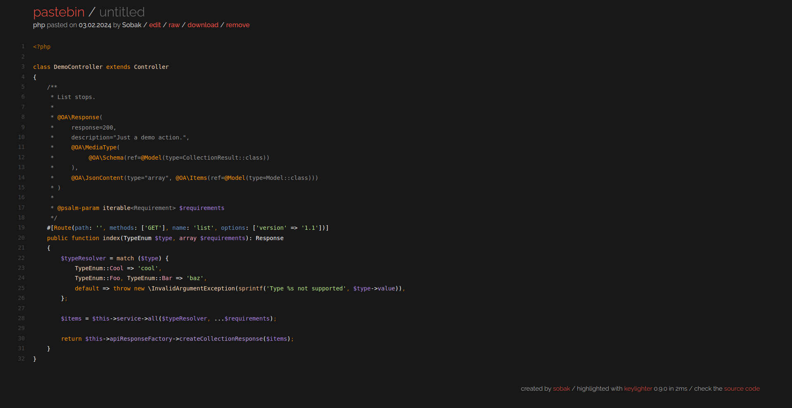
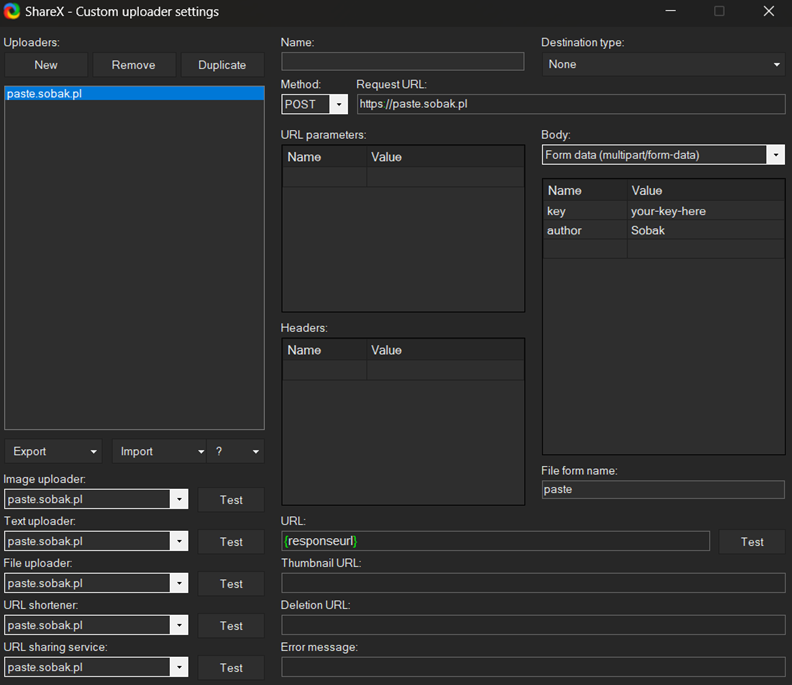

# Pastebin

Simple self-hosted pastebin for sharing code and text snippets.

For live demo please visit [paste.sobak.pl](http://paste.sobak.pl)

## Features

- the best PHP syntax highlighter out there: [KeyLighter](https://keylighter.kadet.net)
  - support for over 35 languages
  - context-aware syntax highlighting
  - nested (e.g. PHP/CSS/JS nested in HTML) highlighting support
- creating, updating and removing pastes
- uploading pastes via multipart POST (e.g. for integrating with ShareX, see below)
- admin panel
- downloading pastes
- showing raw paste representation
- paste's programming language detection assistance

## Setup

In order to set up the project you have to:

1. Install the dependencies with `composer install`
2. Fill in `.env` file (or set these env variables in the system) based on `.env.example`.
   **Make sure** to always set `ADMIN_USERNAME` & `ADMIN_PASSWORD` envs for production,
   otherwise your admin panel will be publicly accessible!
3. Run database migrations with `php artisan migrate`

## Local development

You need to perform setup similar to the one described above (you can omit the `ADMIN_*` env
vars, though) but you can also

- use local Docker containers setup (`docker-compose up -d`)
- generate IDE helpers for Laravel's magic (`composer ide-helpers`)

Tests can be run with `./vendor/bin/phpunit`

## Language detection

The script provides a _very_ naive layer for detecting the paste's programming language.
When user adds a new paste, and they didn't specify its language, they will be prompted
with an optional confirmation dialog with a probable programming language their paste
was created in.

They can accept the suggestion to reduce the likelihood of adding a paste without the
programming language specified.

## ShareX support

You can use this project together with [ShareX](https://getsharex.com) by providing
configuration similar to the below:

